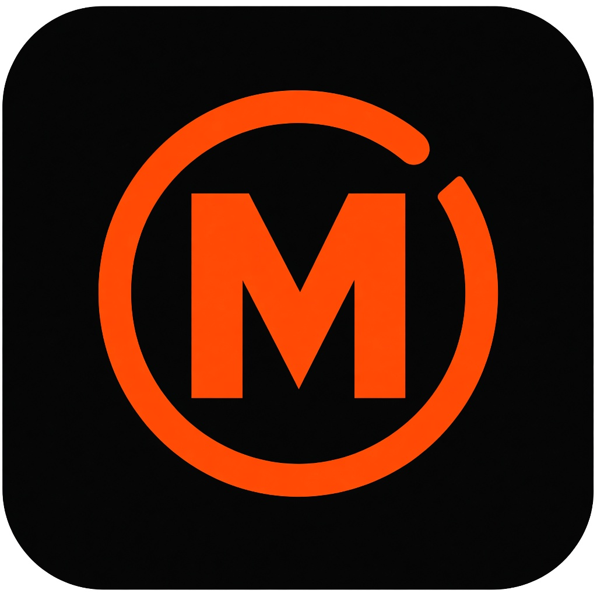

# Momentum

A small always-on-top desktop focus timer. Set a duration, stay on the clock, and get a loud alarm when time is up.

<p align="center">
  
</p>


Built with Electron, React, and Tailwind. Frameless compact window, custom orange **M** mark, hard black/white/orange UI.

## Features

- Countdown with a circular progress ring and a bar along the bottom
- Presets: 5m, 15m, 25m, 45m, 1h, plus custom hours / minutes / seconds
- Always-on-top pin, minimize, and close in a custom title bar
- Default alarm sound, or pick your own audio file (saved for next launch)
- Mute, reset, and a fallback beep if the file cannot play
- Single-instance app so a second launch focuses the existing window

## Design

Neo-brutalist: thick 2px borders, hard offset shadows, no soft glass, no extra chrome. The window is compact (about 360×300), dark, and meant to sit in a corner while you work.

| Token | Hex | Use |
| --- | --- | --- |
| Ink | `#000000` / `#111111` | Window and timer well |
| Signal orange | `#FF4D00` | Logo, ring, primary button, active time |
| Paper | `#FFFFFF` | Secondary buttons, shadows, type |
| Muted | `#A1A1AA` / `#52525B` | Title, paused / idle labels |

**Type**

- UI: system sans (`Segoe UI` / Inter)
- Time: monospace, tabular numbers (`00:25:00`)
- Labels: short, uppercase, wide tracking

**Mark**

The app icon is a black rounded square, orange **M**, incomplete timer ring. The title bar uses a small orange **M** plus the word Momentum.

<p>
  
</p>

**States**

| State | What you see |
| --- | --- |
| Idle / paused | White time, white controls |
| Running | Orange time, **Focusing**, orange ring and bar |
| Alarm | **Time's Up**, bouncing bell, sound wave, orange dismiss button |
| Edit | Hour / minute / second fields, presets, choose-sound row |

## Run locally

```bash
cd fun_coding
npm install
npm run dev
```

`npm start` builds a production preview and opens the same desktop window.

## Package as a desktop app

Close any running `dev` / `start` window first.

```bash
# Windows installer (Setup.exe + desktop shortcut)
npm run build:win

# macOS
npm run build:mac

# Linux
npm run build:linux
```

Installers land in `dist/`. On Windows look for `momentum-1.0.0-setup.exe`.

Unpacked folder only (no installer):

```bash
npm run build:unpack
```

## Project layout

```text
src/main        Electron window, IPC, alarm file picker
src/preload     Bridge to the renderer
src/renderer    React UI (timer, title bar, sounds)
build/          App icon (.png, .ico)
resources/      Icon used by the window
docs/           README preview
```
